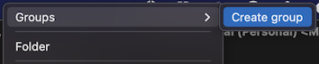
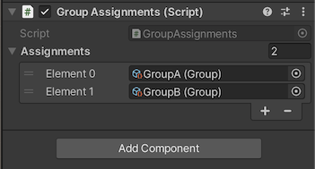

# Unity Groups
Unity3d groups allowing for the grouping and categorization of game objects.

This project is inspired on the [presentation](https://youtu.be/raQ3iHhE_Kk?t=1673) by [Ryan Hipple](https://twitter.com/roboryantron).

Feedback is welcome.

## Plug and Play
1. Open "Package Manager"
2. Choose "Add package from git URL..."
3. Use the HTTPS URL of this repository:
   `https://github.com/yanicksenn/unity-groups.git#1.0.0`
4. Click "Add"

## Usage
- [Group](#user-content-group)
- [Assignments](#user-content-assignments)
- [Listening](#user-content-listening)

### Group

Groups can be created through the asset menu > Create > Groups > ... .



### Assignments

Groups can be assgined to `GameObject`s through the component `GroupAssignments`.



At runtime the assigned `Group`s can be used find all `GameObject`s that have are assigned to this group.
At runtime the groups can be used to find all assigned `GameObject`s.

```c#
public class MyBehaviour : MonoBehaviour
{
    [SerializeField]
    private Group group;

    private void Update()
    {
        foreach (var gameObject in group)
            Debug.Log(gameObject.name);
    }
}
```

