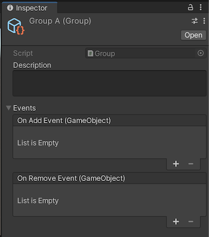
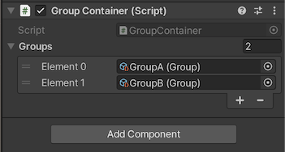

# Unity Groups
Unity3d package allowing the grouping and categorization of GameObjects.

This project is inspired on the [presentation](https://youtu.be/raQ3iHhE_Kk?t=1673) by [Ryan Hipple](https://twitter.com/roboryantron).

Feedback is welcome.

## Plug and Play
1. Open "Package Manager"
2. Choose "Add package from git URL..."
3. Use the HTTPS URL of this repository:
   `https://github.com/yanicksenn/unity-groups.git#1.0.0`
4. Click "Add"

## Usage
- [Group](#user-content-group)
   - [Events](#user-content-events)
- [Group Container](#user-content-group-container)

### Group

Groups can be created through the asset menu > Create > Groups > ... .

#### Events

It is possible to listen to the addition and removal of `GameObjects`.

### Group Container

`GroupContainers` can be used to assign `Groups` to a `GameObject`.

The event `OnEnable()` of the Component will automatically add the `GameObject` to all assigned `Groups`.
The invocation of `OnDisable()` will revers this process.

